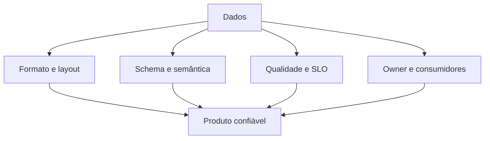

# Introdução

Um data lake sem contratos torna-se conjunto de arquivos cuja estrutura e significado só o produtor conhece. Lakehouse adiciona metadados transacionais, snapshots e evolução, mas não define sozinho grão, métricas ou ownership.

O modelo abrange dados e metadados: schema, partições, chaves, histórico, classificação, lineage, política de mudança e interface de consumo.
