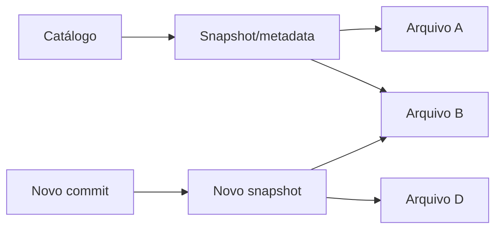

# Tabelas Lakehouse, Transações, Snapshots e Metadados

Formatos de tabela como Apache Iceberg, Delta Lake e Apache Hudi mantêm metadados que apontam para conjuntos consistentes de arquivos. Eles oferecem snapshots, evolução e operações transacionais conforme suas garantias.

Time travel consulta snapshot anterior; não substitui retenção, backup ou histórico semântico. Expiração de snapshots e remoção de arquivos órfãos precisam respeitar leitores concorrentes.

Catálogo resolve nomes, namespaces e versão atual. Concorrência usa controle otimista ou mecanismo equivalente; writers devem tratar conflito e retry idempotente.

> [!note]
> ACID da tabela não garante transação atômica entre tabelas nem qualidade do conteúdo.
