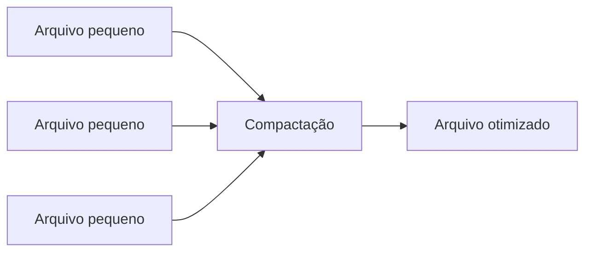

# Particionamento, Clustering, Compactação e Small Files

Partições devem corresponder a filtros frequentes e produzir volume suficiente por parte. Particionar por identificador de alta cardinalidade cria diretórios e arquivos excessivos.

Clustering ordena ou agrupa dados dentro de partições. Tabelas modernas podem ocultar transformação da partição, reduzindo acoplamento da consulta ao layout físico.

Small files surgem de microbatches, alta cardinalidade e writers paralelos. Eles aumentam listagem, planejamento e metadados. Compactação reescreve arquivos em tamanhos-alvo e precisa de agenda, isolamento e custo controlado.

> [!warning]
> Particionamento é decisão física evolutiva; não incorpore caminho de pasta como semântica permanente do consumidor.
