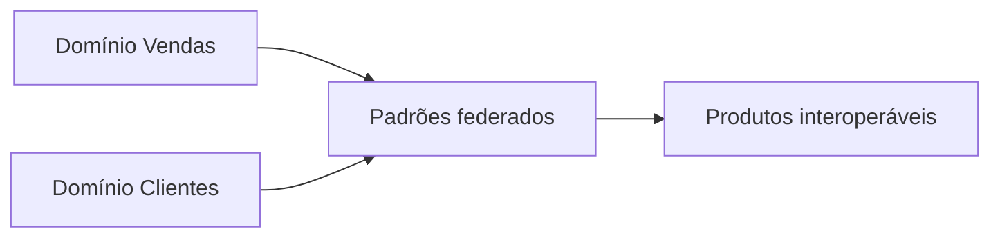

# Domínios, Interoperabilidade, Segurança e Governança

Ownership por domínio aproxima significado do produtor, mas produtos precisam de padrões comuns para interoperar: identificadores, tempo, moeda, classificação, lineage e descoberta.

## Controles federados

- catálogo e nomenclatura;
- identidade corporativa e chaves compartilhadas;
- formatos e contratos versionados;
- classificação e políticas de acesso;
- criptografia e gestão de segredos;
- retenção, deleção e legal hold;
- métricas de qualidade e SLO;
- auditoria e lineage.

Row/column policies e views seguras podem aplicar acesso; dados sensíveis também exigem minimização e finalidade. Cópias derivadas herdam classificação e obrigações.

> [!warning]
> Descentralizar ownership sem plataforma e governança compartilhada cria silos com nomes novos.
