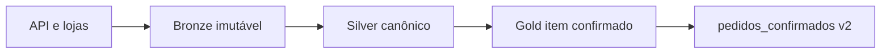

# Estudo de Caso — DataRetail S.A.

A DataRetail publica o produto `pedidos_confirmados`, consumido por finanças, logística e ciência de dados.

## Camadas

- Bronze: eventos originais, fonte, ingestão e payload;
- Silver: um evento canônico por `evento_id`, tipos e chaves validados;
- Gold: item confirmado no grão `(pedido_id, numero_item)`;
- produto: tabela lakehouse particionada por mês de confirmação.

Contrato define valores em centavos, timestamps UTC, timezone da loja, status, política de cancelamento e schema versionado.

SLO: 99,5% dos eventos disponíveis em 15 minutos. Owner de negócio é Operações Comerciais; owner técnico é Plataforma de Pedidos. Métricas cobrem freshness, duplicidade, quarentena e small files.
