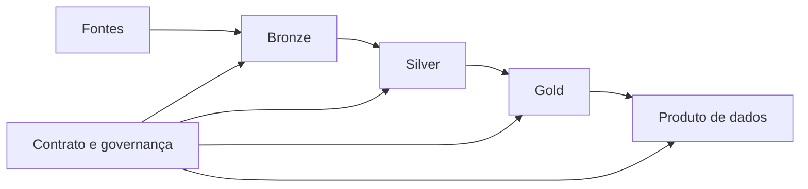

# Módulo 08 — Modelagem para Data Lake, Lakehouse e Produtos de Dados

Arquivos em object storage também possuem modelo: schema, grão, partição, evolução, qualidade, owner e semântica. Este módulo conecta zonas de dados, formatos colunares, tabelas lakehouse e contratos de produtos.

## Percurso

1. [[01-Objetivos|Objetivos]]
2. [[02-Introducao|Introdução]]
3. [[03-Zonas-Bronze-Silver-Gold-e-Responsabilidades|Zonas Bronze, Silver, Gold e Responsabilidades]]
4. [[04-Formatos-Avro-Parquet-ORC-Schema-e-Estatisticas|Formatos Avro, Parquet, ORC, Schema e Estatísticas]]
5. [[05-Tabelas-Lakehouse-Transacoes-Snapshots-e-Metadados|Tabelas Lakehouse, Transações, Snapshots e Metadados]]
6. [[06-Particionamento-Clustering-Compactacao-e-Small-Files|Particionamento, Clustering, Compactação e Small Files]]
7. [[07-Schema-on-Write-Schema-on-Read-e-Evolucao|Schema-on-Write, Schema-on-Read e Evolução]]
8. [[08-Produtos-de-Dados-Contratos-SLOs-e-Ownership|Produtos de Dados, Contratos, SLOs e Ownership]]
9. [[09-Dominios-Interoperabilidade-Seguranca-e-Governanca|Domínios, Interoperabilidade, Segurança e Governança]]
10. [[10-Estudo-de-Caso-DataRetail|Estudo de Caso — DataRetail S.A.]]
11. [[11-Resumo|Resumo]]
12. [[12-Perguntas-de-Entrevista|Perguntas de Entrevista]]
13. [[13-Exercicios|Exercícios]] e [[13-Gabarito|Gabarito]]
14. [[14-Laboratorio|Laboratório]] e [[14-Solucao|Solução]]
15. [[15-Referencias|Referências]]

