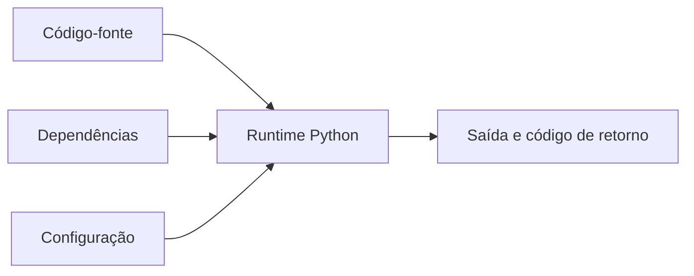

# Introdução

Um programa correto na máquina do autor ainda não é um sistema reproduzível. Versão do interpretador, dependências, variáveis de ambiente, diretório de execução e codificação influenciam o resultado.

Na DataRetail S.A., uma carga local deve se comportar como a carga do CI. Para isso, ambiente e contrato de execução precisam ser explícitos, versionados e validados.

> [!warning]
> Instalar pacotes globalmente mistura projetos e torna defeitos difíceis de reproduzir.
