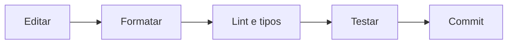

# Ferramentas: Editor, Formatação, Lint e Tipos

Formatação resolve decisões visuais; lint detecta padrões suspeitos; análise de tipos encontra incompatibilidades antes da execução; testes verificam comportamento. São controles complementares.

```python
from pathlib import Path

def contar_linhas(caminho: Path) -> int:
    with caminho.open(encoding="utf-8") as arquivo:
        return sum(1 for _ in arquivo)
```

Um editor com protocolo LSP oferece navegação, renomeação e diagnóstico. A configuração deve ficar no repositório, preferencialmente no `pyproject.toml`, e o CI deve executar os mesmos comandos usados localmente.



Tipos são documentação verificável, mas não validam automaticamente dados externos em runtime.
