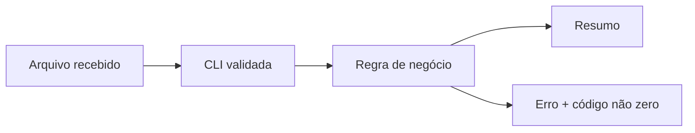

# Estudo de Caso — DataRetail S.A.

A DataRetail recebia arquivos de pedidos por três canais. Um script pessoal funcionava apenas no notebook do autor porque dependia do diretório atual e de uma variável não documentada.

A equipe estabeleceu o seguinte contrato:

- Python com faixa de versões declarada;
- ambiente virtual por checkout;
- caminhos recebidos por CLI e tratados com `pathlib`;
- encoding UTF-8 explícito;
- configuração por variável de ambiente validada no início;
- `main()` com códigos de saída;
- comandos de qualidade idênticos no computador e no CI.

O resultado não foi apenas um script mais organizado: a operação ganhou um contrato observável. Falhas de entrada passaram a ser distinguidas de defeitos do programa, e qualquer pessoa conseguiu reconstruir o ambiente.
