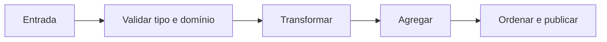

# Introdução

Pipelines falham quando a representação contradiz o domínio: dinheiro em ponto flutuante, chaves ausentes confundidas com valores nulos ou coleções mutadas por múltiplas etapas. Python facilita experimentar, mas não elimina a necessidade de contratos.

Uma lista preserva ordem e duplicatas; um conjunto responde pertinência; um dicionário relaciona chaves a valores. Escolher pela intenção torna o código mais correto e legível.
