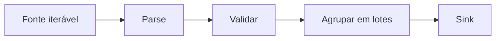

# Introdução

Uma função estabelece um limite semântico: recebe valores, preserva invariantes e devolve um resultado ou uma falha significativa. Módulos dão endereço a essas funções; iteradores permitem conectá-las sem carregar todos os dados na memória.

Exceções pertencem a esse contrato. Capturá-las indiscriminadamente remove contexto; deixá-las sem tradução pode expor detalhes de infraestrutura. A fronteira correta preserva a causa e acrescenta significado do domínio.
