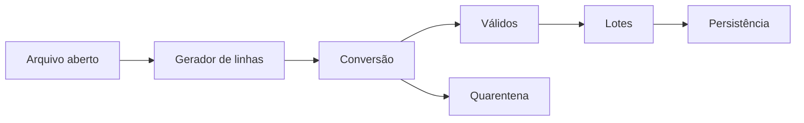

# Estudo de Caso — DataRetail S.A.

A DataRetail recebe milhões de linhas de pedidos. A versão inicial lia tudo em uma lista e encerrava no primeiro registro inválido.

A equipe separou o fluxo em funções:

- `ler_linhas` fornece texto incrementalmente;
- `converter` traduz e lança exceção de domínio;
- `validos` envia falhas recuperáveis à quarentena;
- `lotes` agrupa um número limitado de registros;
- o sink confirma cada lote antes de pedir o próximo.

O arquivo é controlado por `with`; exceções inesperadas preservam traceback. A memória passa a depender do tamanho do lote, não do arquivo inteiro.
