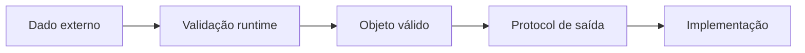

# Introdução

Classes agregam estado e comportamento quando existe uma identidade ou um conjunto de invariantes que precisa permanecer válido. Dataclasses reduzem código cerimonial para registros. Type hints permitem verificar contratos antes da execução.

Nem todo dicionário precisa virar classe. Objetos são úteis quando o domínio possui comportamento, transições, igualdade de valor ou interfaces estáveis. Para transformações locais, funções e estruturas simples continuam adequadas.
