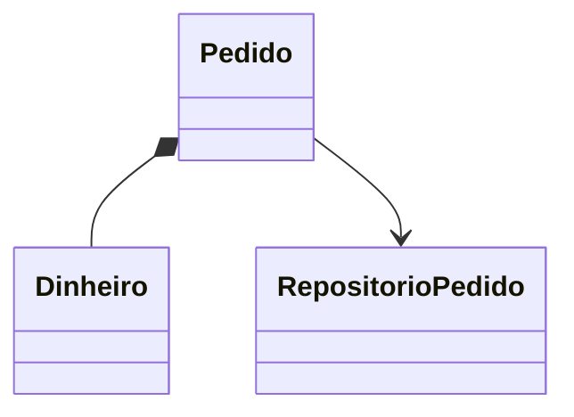

# Estudo de Caso — DataRetail S.A.

A DataRetail manipulava pedidos como dicionários. Erros de digitação em chaves e transições inválidas apareciam apenas em produção.

A equipe introduziu:

- `Dinheiro`, dataclass imutável com centavos não negativos;
- `Pedido`, entidade imutável com ID, status e total;
- método que retorna nova versão ao cancelar, sem alterar a anterior;
- `Repositorio[Pedido]` como Protocol;
- repositório em memória nos testes e adaptador SQL na aplicação.

JSON permanece desconhecido até parsing e validação. Somente depois ele entra no núcleo como objeto válido. A tipagem reduz combinações acidentais; invariantes runtime protegem a fronteira real.
