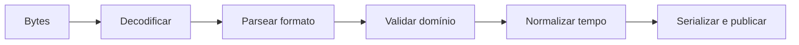

# Introdução

Um arquivo não é apenas conteúdo: possui caminho, permissões, encoding, formato, versão, convenção de tempo e ciclo de publicação. Assumir defaults transforma diferenças de ambiente em corrupção silenciosa.

As etapas devem ser separadas. Um JSON sintaticamente válido ainda pode violar o schema; uma data parseável pode não representar um instante inequívoco; um rename pode deixar de ser atômico entre filesystems.
