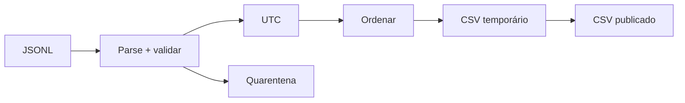

# Estudo de Caso — DataRetail S.A.

A DataRetail recebe eventos JSONL com ID, instante ISO 8601 e valor em centavos. Alguns produtores enviavam timestamp sem offset e IDs fora do padrão.

A nova fronteira executa:

- leitura UTF-8 linha a linha;
- parsing JSON isolado por registro;
- validação de chaves e tipos;
- ID por regex ancorada;
- rejeição de datetime naive;
- conversão para UTC com `Z`;
- ordenação determinística;
- escrita CSV temporária e substituição atômica.

O consumidor nunca observa um arquivo parcialmente escrito. Rejeições preservam número da linha e motivo sem expor dados sensíveis.
