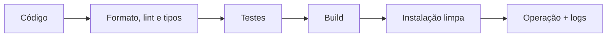

# Introdução

Testes verificam comportamento; análise estática examina código sem executá-lo; logs explicam execuções reais; empacotamento define o artefato entregue. Nenhum controle substitui os demais.

O gate deve ser rápido localmente, completo no CI e reproduzível. Flakiness não é apenas incômodo: reduz confiança e incentiva ignorar falhas legítimas.
