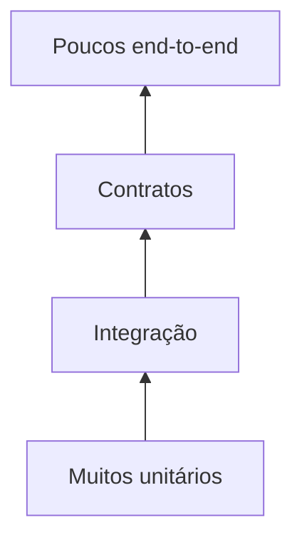

# Estratégia, Pirâmide e Tipos de Teste

Testes unitários verificam unidades pequenas com feedback rápido. Integração confirma colaboração com filesystem, banco ou serviço. Contrato verifica compatibilidade entre produtor e consumidor. End-to-end percorre o fluxo completo e custa mais para diagnosticar.

A pirâmide é heurística, não meta de contagem. A distribuição depende dos riscos. Transformações puras merecem muitos unitários; adaptadores SQL precisam de testes contra o mecanismo real; schemas compartilhados exigem contratos.

Cada teste segue arrange, act, assert e deve falhar por uma razão clara. Testes independentes não dependem de ordem, relógio real, rede externa ou estado residual.
