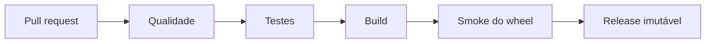

# Estudo de Caso — DataRetail S.A.

Um pipeline da DataRetail era copiado para servidores e testado manualmente. A equipe passou a produzir um wheel e estabeleceu um gate:

- formatação, lint e tipos;
- unitários de transformação;
- integração com SQLite e filesystem temporário;
- contratos de schema;
- build de sdist e wheel;
- instalação do wheel em ambiente limpo;
- smoke test da CLI;
- logs JSON com `run_id`, `lote_id`, contagens e duração.

Tokens e registros pessoais foram excluídos por allowlist de campos. A release passou a ser rastreável até o commit e reproduzível a partir do lock aprovado.
