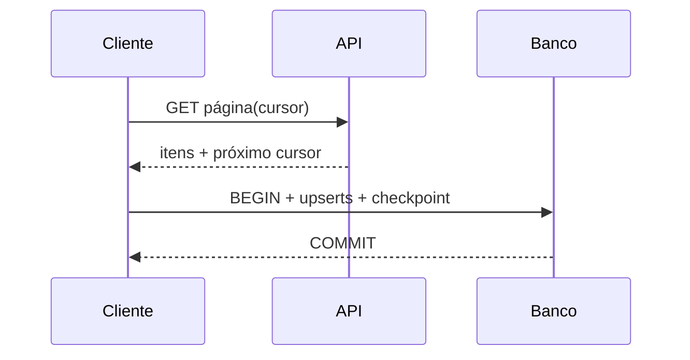

# Estudo de Caso — DataRetail S.A.

A DataRetail sincroniza catálogo de marketplace por cursor. A versão anterior salvava o cursor antes dos produtos e perdia uma página quando o processo falhava.

O protocolo corrigido:

- GET com timeout e token em header;
- validação de status, JSON e contrato;
- upsert por `produto_id` e maior versão;
- produtos e próximo cursor na mesma transação;
- retry somente para falhas transitórias;
- detecção de cursor repetido;
- métricas de páginas, itens, rejeições e atraso.

Reexecuções atualizam as mesmas chaves e não duplicam produtos. O watermark só avança depois do commit.
