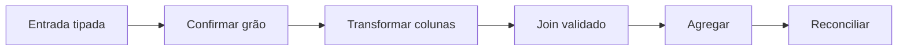

# Introdução

NumPy armazena elementos homogêneos em blocos n-dimensionais; Pandas acrescenta rótulos, tipos tabulares e alinhamento. A conveniência aumenta o risco de coerção de dtype, alinhamento inesperado e fanout em joins.

O resultado correto depende tanto da operação quanto do contrato: chave, cardinalidade, unidade, nulos e ordem. Vetorização acelera loops em código nativo, mas não corrige um modelo errado.
