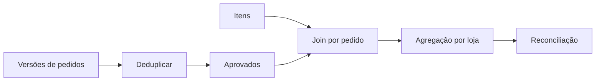

# Estudo de Caso — DataRetail S.A.

A DataRetail recebe versões de pedidos e itens. O mart deve usar a maior versão aprovada, enriquecer produtos e totalizar por loja.

Controles adotados:

- dtypes string e inteiros nullable;
- timestamp UTC;
- ordenação e deduplicação por ID/versão;
- filtro de aprovados antes do join;
- `many_to_one` entre itens e produtos;
- rejeição de produto desconhecido;
- groupby com grão loja;
- reconciliação entre itens aprovados e mart.

O join é auditado com indicador para que linhas órfãs não desapareçam silenciosamente.
