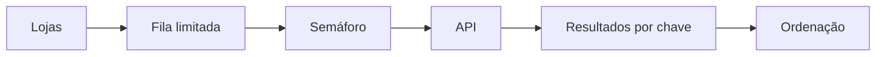

# Estudo de Caso — DataRetail S.A.

A DataRetail coletava lojas sequencialmente. Uma tentativa de criar uma task por loja causou throttling e milhares de objetos em memória.

O redesenho adotou:

- fila de trabalho limitada;
- semáforo para no máximo oito requests;
- timeout por tentativa e deadline do lote;
- retry apenas de falhas transitórias;
- idempotency key por loja e janela;
- resultados indexados e ordenados antes da publicação;
- métricas de concorrência, latência, retries e falhas.

O throughput cresceu sem ultrapassar o limite remoto, e o resultado deixou de depender da ordem de conclusão das tasks.
