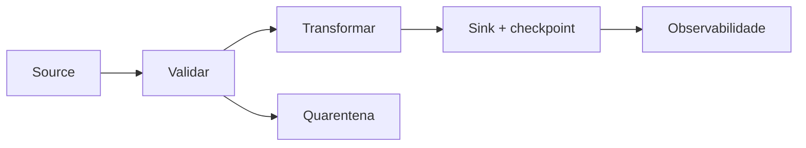

# Introdução

Um pipeline não termina quando transforma dados corretamente. Ele precisa retomar após falha, rejeitar entradas inválidas, explicar seu progresso e produzir o mesmo estado quando reexecutado.

O projeto final usa a biblioteca padrão para evidenciar fundamentos. Ferramentas maiores podem substituir adapters, mas contratos de grão, estado, falha e telemetria permanecem.
