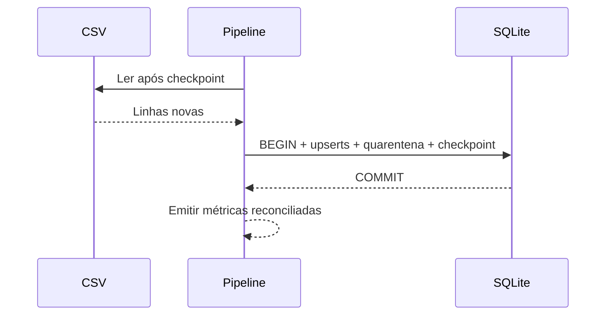

# Estudo de Caso — DataRetail S.A.

A DataRetail recebe um CSV append-only. Cada linha tem `pedido_id`, `versao`, `status` e `valor_centavos`. O pipeline anterior truncava a tabela e recarregava tudo.

O novo desenho usa:

- linha do arquivo como checkpoint;
- upsert condicionado à maior versão;
- transação por lote incluindo checkpoint;
- quarentena com linha e motivo;
- logs JSON por execução;
- reconciliação de leitura, aceitação e rejeição;
- reexecução sem mudanças adicionais.

Se o processo falha antes do commit, o checkpoint não avança. Se falha depois, a próxima execução começa após as linhas confirmadas.
