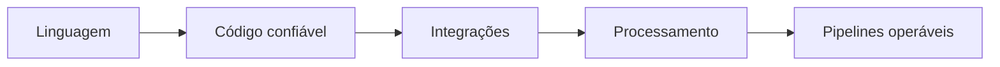

# Volume 06 — Python

Este volume desenvolve programação Python do ambiente de execução à construção de pipelines observáveis, com fundamentos antes de bibliotecas especializadas.

## Módulos

1. [[01-Fundamentos-Ambiente-e-Ferramentas-Python/README|Fundamentos, Ambiente e Ferramentas Python]] — concluído.
2. [[02-Tipos-Controle-de-Fluxo-e-Colecoes/README|Tipos, Controle de Fluxo e Coleções]] — concluído.
3. [[03-Funcoes-Modulos-Excecoes-e-Iteradores/README|Funções, Módulos, Exceções e Iteradores]] — concluído.
4. [[04-Orientacao-a-Objetos-Dataclasses-e-Tipagem/README|Orientação a Objetos, Dataclasses e Tipagem]] — concluído.
5. [[05-Arquivos-Serializacao-Datas-e-Expressoes-Regulares/README|Arquivos, Serialização, Datas e Expressões Regulares]] — concluído.
6. [[06-Testes-Qualidade-Logging-e-Empacotamento/README|Testes, Qualidade, Logging e Empacotamento]] — concluído.
7. [[07-Acesso-a-Bancos-de-Dados-e-APIs/README|Acesso a Bancos de Dados e APIs]] — concluído.
8. [[08-NumPy-Pandas-e-Processamento-Tabular/README|NumPy, Pandas e Processamento Tabular]] — concluído.
9. [[09-Concorrencia-Paralelismo-e-Performance/README|Concorrência, Paralelismo e Performance]] — concluído.
10. Pipelines de Dados, Observabilidade e Projeto Final — planejado.

