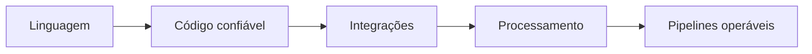

# Volume 06 — Python

Este volume desenvolve programação Python do ambiente de execução à construção de pipelines observáveis, com fundamentos antes de bibliotecas especializadas.

## Módulos

1. [[01-Fundamentos-Ambiente-e-Ferramentas-Python/README|Fundamentos, Ambiente e Ferramentas Python]] — concluído.
2. [[02-Tipos-Controle-de-Fluxo-e-Colecoes/README|Tipos, Controle de Fluxo e Coleções]] — concluído.
3. Funções, Módulos, Exceções e Iteradores — planejado.
4. Orientação a Objetos, Dataclasses e Tipagem — planejado.
5. Arquivos, Serialização, Datas e Expressões Regulares — planejado.
6. Testes, Qualidade, Logging e Empacotamento — planejado.
7. Acesso a Bancos de Dados e APIs — planejado.
8. NumPy, Pandas e Processamento Tabular — planejado.
9. Concorrência, Paralelismo e Performance — planejado.
10. Pipelines de Dados, Observabilidade e Projeto Final — planejado.

