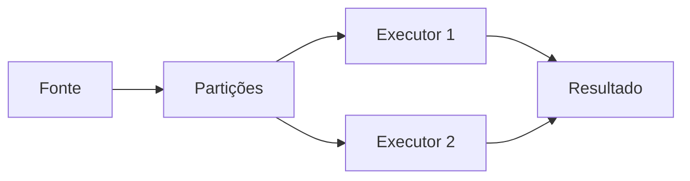

# Introdução

Uma máquina possui limites de CPU, memória, armazenamento e vazão. O Spark divide dados e computação entre processos, mas acrescenta coordenação, serialização, rede e recuperação. Distribuir é uma troca: capacidade e paralelismo em troca de complexidade.

As operações formam um plano e o processamento começa quando uma ação exige resultado. Essa separação permite otimizar o trabalho completo.
