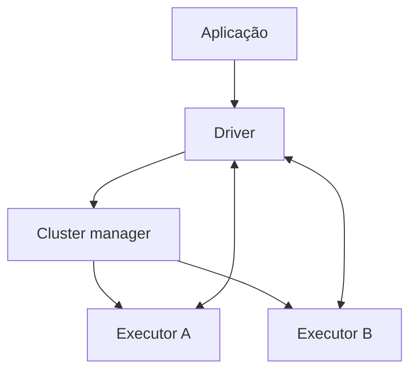

# Driver, Executors e Cluster Manager

O driver executa o programa principal, constrói planos e coordena tasks. Executors executam tasks, mantêm partições em cache e devolvem resultados. O cluster manager aloca recursos; ele não interpreta o plano de dados.

`collect()` move dados ao driver e pode esgotar sua memória. Variáveis locais também não são compartilhadas: executors são processos distintos.
