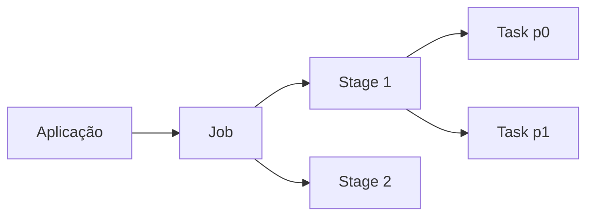

# Aplicações, Jobs, Stages e Tasks

Uma aplicação abrange driver e executors. Uma ação costuma criar um job. O job é dividido em stages nas fronteiras de redistribuição. Cada stage contém tasks, normalmente uma por partição.

Uma partição enorme produz task longa; partições minúsculas geram sobrecarga. Essa hierarquia conecta código às métricas da Spark UI.
