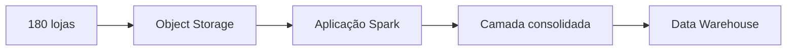

# Estudo de Caso — DataRetail S.A.

A DataRetail recebe pedidos de 180 lojas. O processo sequencial ultrapassa a janela noturna em promoções. As medições mostram 2,4 TB por execução, arquivos independentes e transformações paralelizáveis.

A equipe escolhe Spark para leitura e transformação, mantendo o banco transacional como sistema de registro. O driver coordena; executors processam partições; o armazenamento de objetos contém entradas e saídas.

Os critérios de aceite são contagem reconciliada por loja, execução idempotente e ausência de `collect()` sobre o conjunto integral.
