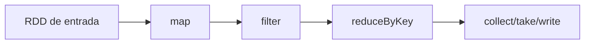

# Introdução

Um Resilient Distributed Dataset é uma coleção imutável dividida em partições. Cada transformação produz outro RDD; o Spark conserva dependências suficientes para recomputar partições perdidas.

RDDs permitem lógica arbitrária, mas não informam ao otimizador o significado das colunas. Para dados estruturados, [[03-DataFrames-Schemas-Expressoes-e-Catalyst/README|DataFrames]] oferecem planos mais ricos e normalmente melhores resultados.
