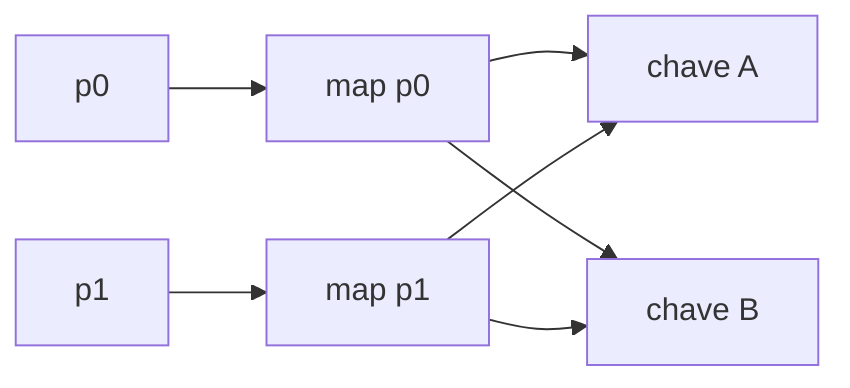

# Transformações Narrow e Wide

Em dependência narrow, cada partição filha depende de poucas partições ancestrais e as operações podem ser encadeadas na mesma task. `map`, `filter` e `mapPartitions` são exemplos usuais.

Em dependência wide, uma partição filha pode receber dados de muitas ancestrais. `groupByKey`, `reduceByKey`, `distinct` e ordenação normalmente provocam shuffle e nova fronteira de stage.

Shuffle envolve serialização, disco e rede. Ele não é erro por si; torna-se problema quando desnecessário, desequilibrado ou dimensionado incorretamente.
