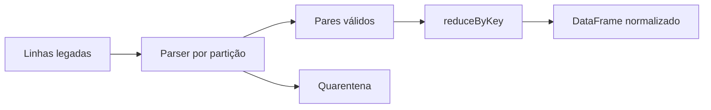

# Estudo de Caso — Conciliação por Loja

A DataRetail precisa conciliar registros legados sem schema uniforme. Cada linha é validada por um parser específico e convertida em `(loja_id, valor_centavos)`. A flexibilidade justifica RDD na borda; após normalização, os dados migram para DataFrame.

`reduceByKey` soma valores antes do shuffle. Registros inválidos são enviados a uma saída de quarentena, sem acumulá-los no driver. Métricas por partição revelam duas lojas com volume desproporcional.

A solução limita a API RDD à etapa que realmente precisa de objetos arbitrários.
