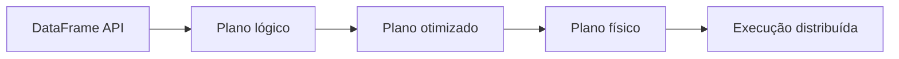

# Introdução

Um DataFrame representa uma relação distribuída com colunas nomeadas e tipos conhecidos. Ao usar expressões, o programa informa **o que** calcular; o Spark escolhe **como** executar.

Essa separação permite projeção e filtros antecipados, escolha de joins e geração de código. A vantagem diminui quando a lógica é escondida em funções opacas.
