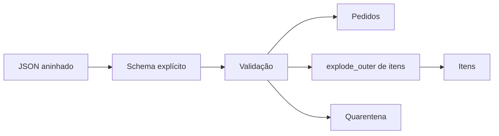

# Estudo de Caso — Normalização de Eventos

Eventos de checkout chegam com pedido, cliente e itens aninhados. A DataRetail define schema explícito, preserva o evento bruto para auditoria e cria duas relações: pedidos e itens.

Expressões nativas normalizam UF, datas e valores. Registros sem `pedido_id` vão à quarentena. Métricas contabilizam entrada, válidos, inválidos e itens produzidos, garantindo reconciliação.
