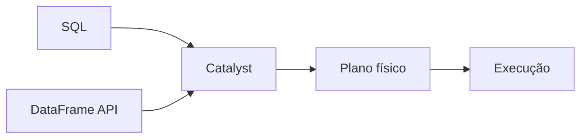

# Introdução

Spark SQL e DataFrame API produzem planos equivalentes quando expressam a mesma lógica. SQL favorece legibilidade relacional; a API facilita composição programática. Ambos passam pelo Catalyst.

O custo dominante costuma surgir em joins, agregações e ordenações, pois redistribuem dados. Antes de executar, estime linhas por chave e valide a granularidade de cada relação.
