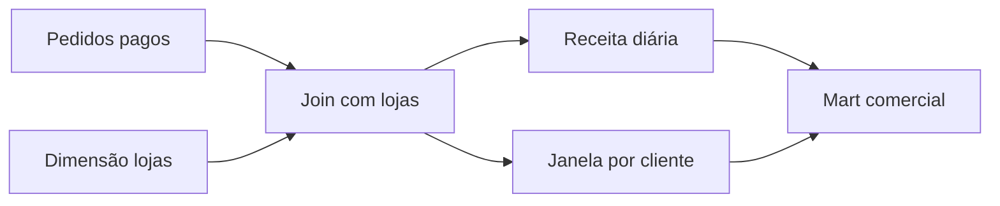

# Estudo de Caso — Receita e Recorrência

A DataRetail consolida pedidos pagos, dimensão de lojas e histórico de clientes. A dimensão é validada como única por `loja_id` e transmitida por broadcast. A receita diária é agregada em centavos.

Uma janela por cliente, ordenada por instante e pedido, calcula pedido anterior e dias desde a última compra. Outra janela seleciona o cadastro vigente de cada loja.

Reconciliações garantem que o join não multiplique pedidos e que a soma publicada coincida com a origem válida.
