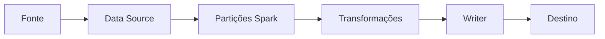

# Introdução

Leitura converte bytes e metadados em partições; escrita faz o caminho inverso. Desempenho depende de quantidade de arquivos, compressão, projeção, filtros, latência da fonte e capacidade de commit.

Um formato eficiente não corrige layout ruim. Milhões de arquivos pequenos ou partições por chave de alta cardinalidade tornam metadados e listagem o gargalo antes que as tasks processem dados.
