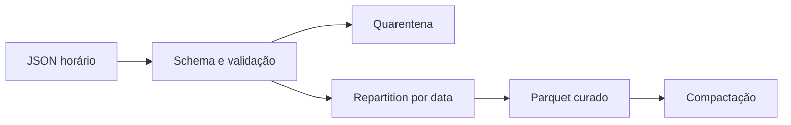

# Estudo de Caso — Camada Curada

A DataRetail recebe JSON por hora e publica pedidos em Parquet. O schema explícito captura registros corrompidos; dados válidos são normalizados e particionados por `data_negocio`, enquanto quarentena preserva payload e motivo.

Cada lote grava em área temporária, valida contagem e soma em centavos, e só então publica. Uma rotina compacta partições fechadas. Métricas incluem arquivos, bytes médios, registros ruins e tempo de listagem.
