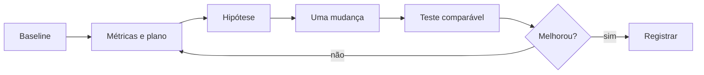

# Introdução

Tempo total pode ser dominado por CPU, I/O, rede, memória, agendamento ou espera de recurso. A média esconde tasks extremas; um único straggler determina o fim do stage.

Compare mesma entrada, cluster, aquecimento e critério. Sem baseline reproduzível, mudanças simultâneas produzem histórias, não evidência.
