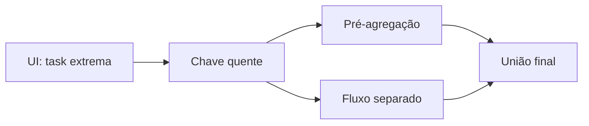

# Estudo de Caso — Otimização do Fechamento

O fechamento diário passa de 35 para 110 minutos em promoções. A UI mostra um stage com 400 tasks: mediana de 40 segundos e máximo de 43 minutos. A task extrema recebe 38% do shuffle por causa da chave “marketplace”.

A equipe pré-agrega por pedido, processa marketplace separadamente com sal controlado e reúne resultados. AQE coalescence reduz tasks vazias. O benchmark cai para 47 minutos, sem aumentar cluster, e reconciliações monetárias permanecem idênticas.
