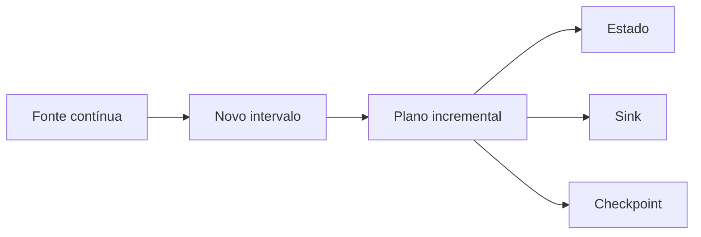

# Introdução

Uma consulta streaming descreve transformações sobre uma tabela de entrada que recebe novas linhas. O mecanismo acompanha quais dados foram consumidos e atualiza a tabela de resultado incrementalmente.

Baixa latência não elimina batch: o modo padrão usa micro-batches pequenos. A confiabilidade depende da combinação entre fonte, checkpoint, transformação e sink, não de uma opção isolada.
