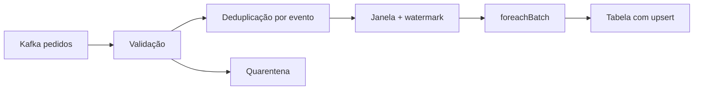

# Estudo de Caso — Pedidos em Tempo Quase Real

A DataRetail consome pedidos Kafka e publica receita por loja em janelas de cinco minutos. A análise histórica mostra que 99,7% chegam em até 12 minutos; o watermark é definido em 20 minutos, com reconciliação diária para a cauda tardia.

O checkpoint é exclusivo por ambiente. `batch_id` e identificador da query compõem a chave de commit. Métricas acompanham atraso, backlog, estado, descartes tardios e duração do trigger.
