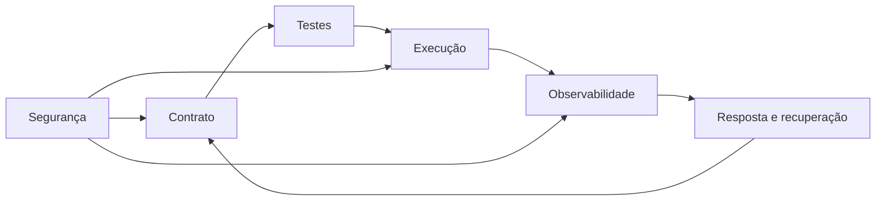

# Introdução

Confiabilidade combina correção, disponibilidade, recuperabilidade, observabilidade e segurança. Um job verde pode publicar dados errados; um resultado correto pode chegar tarde; um pipeline rápido pode expor dados pessoais.

Cada camada precisa de evidência: invariantes de dados, métricas técnicas, rastreabilidade da versão e controles de acesso.
