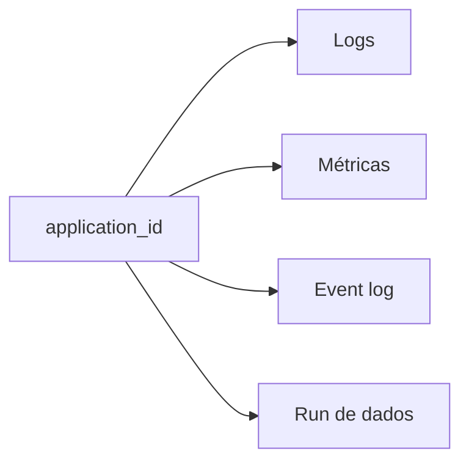

# Logs, Métricas, Event Logs e Lineage

Logs estruturados devem incluir aplicação, execução, dataset, partição lógica, versão e erro. Não registre payload sensível. Métricas técnicas cobrem duração, retries, shuffle e estado; métricas de dados cobrem entrada, saída, quarentena, atraso e reconciliação.

Event logs alimentam History Server e explicam execução física. Lineage registra fontes, transformações e destinos em nível de dataset ou coluna, permitindo análise de impacto e auditoria.

Alertas devem representar impacto e ação possível; cardinalidade descontrolada de labels pode derrubar o sistema de métricas.
