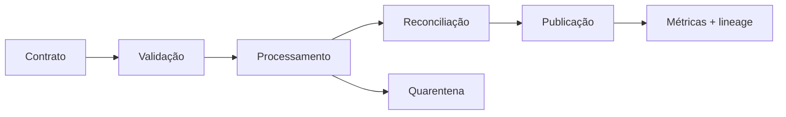

# Estudo de Caso — Pipeline Confiável

A DataRetail publica pedidos curados sob contrato de unicidade, valores não negativos e atraso máximo. Transformações puras são testadas; integração valida catálogo e permissões; um dataset dourado protege regras monetárias.

Cada run registra código, entrada, contagens e somas. A identidade Spark lê apenas a zona necessária e grava staging/destino. Um teste de desastre interrompe o commit, confirma ausência de publicação parcial e repete a execução com o mesmo resultado.
