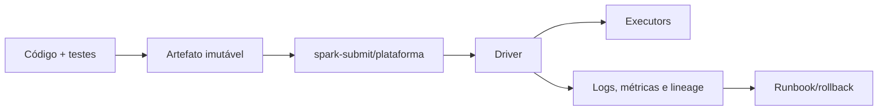

# Introdução

O cluster manager fornece recursos, mas não fornece automaticamente reprodutibilidade, segurança ou confiabilidade. O mesmo artefato deve atravessar ambientes com configuração controlada e evidência de versão.

Operação começa no desenho: um job sem unidade idempotente, contrato ou métrica não se torna operável apenas ao ser colocado em Kubernetes.
