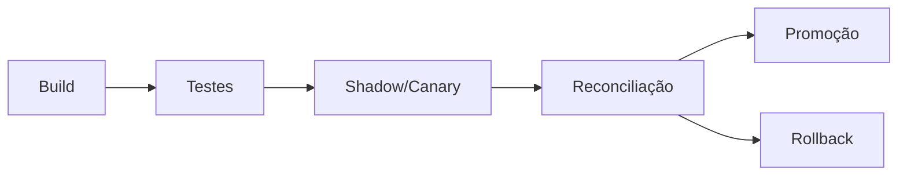

# CI/CD, Deploy Progressivo e Rollback

CI valida lint, testes, segurança, pacote e smoke test. CD promove o mesmo artefato, aplicando configuração por ambiente. Migrações de schema e checkpoint exigem plano próprio.

Deploy shadow executa sem publicar; canary processa partição ou intervalo limitado; blue-green mantém versões lado a lado e troca referência após reconciliação.

Rollback de código não desfaz dados já publicados. Antes do deploy, defina compatibilidade de leitura/escrita, versão de tabelas, checkpoint e estratégia de restauração.

