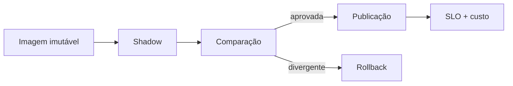

# Estudo de Caso — Deploy Spark

A DataRetail empacota o pipeline em imagem identificada por digest. CI executa testes e scan; CD promove a mesma imagem ao cluster Kubernetes com service account e configurações do ambiente.

O deploy começa em shadow para um dia recente. Contagem, soma em centavos e distribuição por loja são comparadas à versão atual. Após aprovação, uma referência de tabela muda para a nova saída.

Runbooks cobrem pod do driver, falta de executors, throttling da fonte e falha de publicação.
